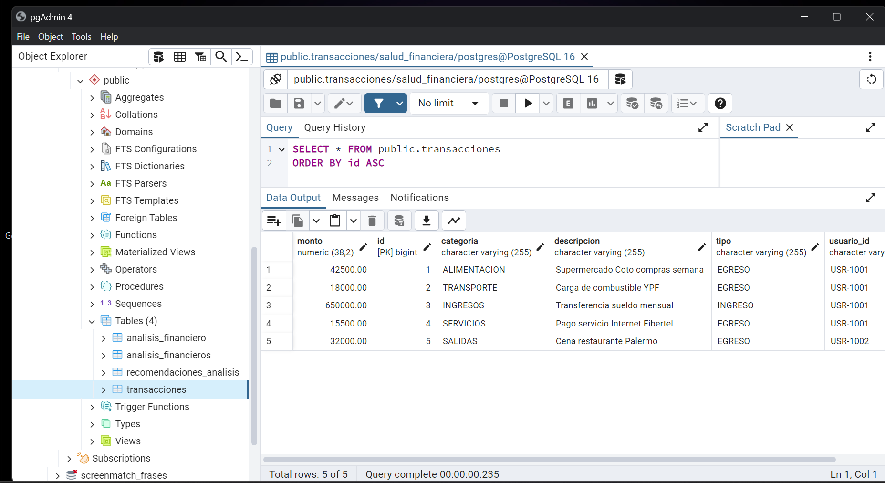
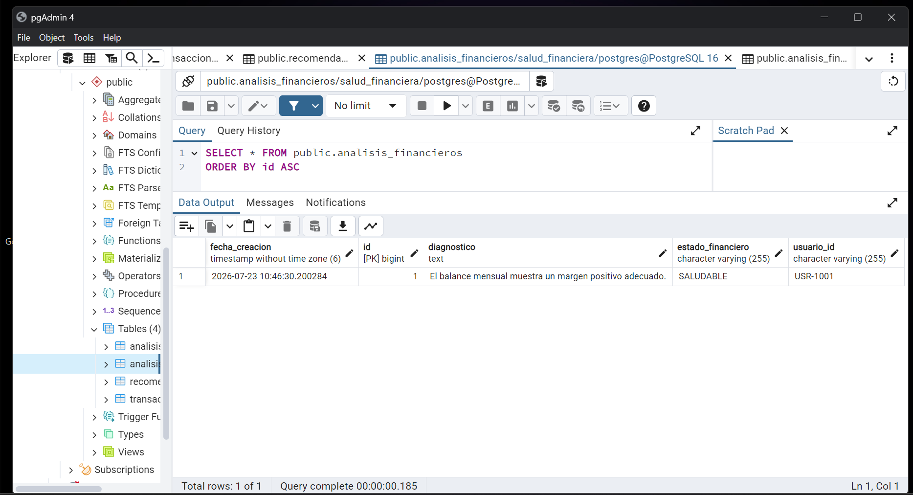

## 🚀 Backend & Integración de Capas (Spring Boot + Python NLP)

Este módulo backend actúa como **orquestador principal** del sistema. Se encarga de recibir las peticiones del Frontend, gestionar la persistencia en PostgreSQL y consumir sincrónicamente el microservicio de Data Science (Python) para obtener el análisis con Inteligencia Artificial/NLP.

---

### 🔄 Flujo de Funcionamiento

1. **Recepción & Validación**: El controlador de Spring Boot recibe el JSON del Frontend y valida la estructura de datos (transacciones, montos positivos, campos obligatorios).
2. **Persistencia Inicial**: Se guardan los registros crudos de las transacciones en la base de datos PostgreSQL.
3. **Invocación al Microservicio Data**: Se realiza una petición HTTP POST desde Spring Boot hacia la API de Python (`http://localhost:8008`) enviando el perfil de gastos.
4. **Procesamiento NLP**: El microservicio de Python clasifica/evalúa las métricas e Inteligencia Artificial, determinando el perfil financiero y generando recomendaciones/tips.
5. **Persistencia Consolidada**: Spring Boot recibe la respuesta de Python, guarda el perfil financiero resultante en PostgreSQL y devuelve la respuesta unificada al Frontend.

---

### 🔌 Especificación de Endpoints

#### 1. Frontend ↔ Java Backend (Spring Boot)
* **URL**: `http://localhost:8080/api/v1/analisis/procesar`
* **Método**: `POST`
* **Descripción**: Endpoint principal expuesto al cliente para procesar la salud financiera.
* **Payload de entrada (Request)**:
  
* ```json
  {
    "usuarioId": "USR-12345",
    "transacciones": [
      {
        "descripcion": "Supermercado Carrefour",
        "monto": 45000.00,
        "tipo": "EGRESO",
        "categoria": "ALIMENTACION"
      },
      {
        "descripcion": "Cobro de Sueldo",
        "monto": 500000.00,
        "tipo": "INGRESO",
        "categoria": "INGRESOS"
      }
    ]
  }
  ```
  * Respuesta exitosa (Response 200 OK):
   
  
  ```JSON
{
"estadoFinanciero": "SALUDABLE",
"diagnostico": "Tus ingresos superan holgadamente tus egresos operativos.",
"tips": [
"Considerá destinar un 10% de tu saldo positivo a un fondo de reserva.",
"Mantén controlados los gastos hormiga en compras secundarias."
]
}  
  ```

2. Java Backend ↔ Servicio Data (Python NLP)
* URL: http://localhost:8008/api/v1/analizar-perfil
* Método: **POST**
* Descripción: Microservicio interno consumido mediante **RestClient** por el backend de Java.
* Payload de entrada (Request desde Java):

```JSON
{
  "usuarioId": "USR-12345",
  "transacciones": [
    {
      "descripcion": "Supermercado Carrefour",
      "monto": 45000.00,
      "tipo": "EGRESO",
      "categoria": "ALIMENTACION"
    }
  ]
}
```
* Respuesta del Microservicio (Response a Java):

```JSON
{
  "estadoFinanciero": "SALUDABLE",
  "diagnostico": "Análisis completado por el modelo NLP.",
  "tips": [
    "Tip sugerido por modelo de evaluación 1",
    "Tip sugerido por modelo de evaluación 2"
  ]
}
```

## 🛠️ Puertos Utilizados
* Java Spring Boot: 8008

* Python Microservice: 8000
## Pruebas con Python
* Si Python lee la DB directamente: Puede conectarse con **SQLAlchemy** o **psycopg2** apuntando a la misma base    
de datos **salud_financiera** en el puerto **5432** y consultar directamente la tabla **transacciones**.

* Si Python consulta a través de Java: Podés crear un endpoint simple en tu controller de Spring Boot    
(**GET /api/v1/transacciones/usuario/{usuarioId}**) para que Python obtenga los registros mockeados por HTTP.

```Python 
import requests

# Python lee los datos cargados desde Java:
response = requests.get("http://localhost:8080/api/v1/analisis/transacciones/USR-1001")
transacciones = response.json()
``` 

## Imagenes DB




