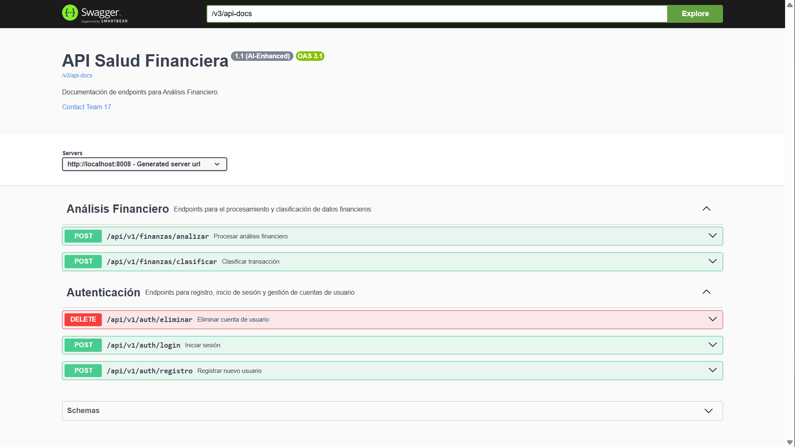

## 🛠️ Entorno de Desarrollo y Flujo de Trabajo

El proyecto utiliza una arquitectura distribuida que permite trabajar cada módulo en su IDE ideal, orquestando todo el ecosistema mediante **Docker Desktop**.

---

### 🔀 Integración VSC + IntelliJ IDEA + Docker

| Herramienta | Módulo / Función | Descripción |
| :--- | :--- | :--- |
| **Visual Studio Code** | Microservicio Python (NLP) | Desarrollo de la API en FastAPI, lógica de recomendaciones y modelos `.pkl`. Cuenta con su propio `Dockerfile`. |
| **IntelliJ IDEA** | Backend Java (Spring Boot) | Desarrollo de la API Gateway, modelos de datos relacionales y orquestación general con `docker-compose.yml`. |
| **Docker Desktop** | Motor y Monitoreo | Ejecuta los contenedores isolados (`postgres_db`, `python_nlp_api`, `spring_backend`) y permite la lectura de logs en tiempo real. |

---

### 🖥️ Uso Diario del Entorno

1. **Abrir Docker Desktop:** Asegúrate de que el motor de Docker esté iniciado antes de ejecutar la aplicación.
2. **Levantar los servicios:** Desde la terminal integrada en la raíz del proyecto, ejecuta:

````bash
docker compose up -d --build
````
1. Monitorear y Controlar: Utiliza la interfaz visual de Docker Desktop para verificar la salud de los contenedores y validar los puertos expuestos:

Python NLP API: **http://localhost:8000**

Spring Boot Backend: **http://localhost:8008**

PostgreSQL Database: **localhost:5432**

## 📥 Requisitos de Instalación
Para colaborar en el proyecto es imprescindible contar con el motor de Docker instalado localmente:

* 🐳 [Descargar Docker Desktop Oficial](https://www.docker.com/products/docker-desktop/)

## Vista del mapeo con Swagger



___
## 🚀 Endpoints de Finanzas

A continuación se detallan los endpoints disponibles para el análisis y clasificación de finanzas personales.

---

### 1. Analizar Finanzas

Realiza un análisis financiero integral a partir de los datos generales del usuario y su historial de transacciones.

- **Método:** `POST`
- **URL:** `/api/v1/finanzas/analizar`
- **Headers:** `Content-Type: application/json`

#### 📥 Ejemplo de Request Body:

````json
{
  "ingreso_mensual": 650000.00,
  "nivel_endeudamiento": 2,
  "frecuencia_ahorro": "MENSUAL",
  "monto_inversion": 50000.00,
  "deuda_total": 120000.00,
  "objetivo_presupuesto": 300000.00,
  "pago_mensual_deuda": 15000.00,
  "servicios_suscripcion": 4,
  "fondo_emergencia": 100000.00,
  "transacciones": [
    {
      "descripcion": "Supermercado Coto compras semana",
      "valor": 42500.00,
      "categoria": "ALIMENTACION",
      "fecha": "2026-08-18"
    }
  ]
}
````
2. Clasificar Transacción / Perfil Financiero
   Clasifica un movimiento puntual asociándolo al perfil financiero y metas de ahorro del usuario.

Método: **POST**

URL: **/api/v1/finanzas/clasificar**

Headers: **Content-Type: application/json**

### 📥 Ejemplo de Request Body:

````json
{
  "usuario_id": "USR-1001",
  "ingreso_mensual": 650000.00,
  "ahorro_actual": 150000.00,
  "meta_ahorro": 300000.00,
  "nivel_endeudamiento": 2,
  "frecuencia_ahorro": "MENSUAL",
  "descripcion": "Supermercado Coto compras semana",
  "valor": 42500.00
}
````

## 🛠️ Arquitectura de Tratamiento de Errores

La estructura queda dividida entre el paquete `dto.error` para las respuestas de API y el paquete `exception` para las clases de manejo de errores:

````text
saludfinanciera/finanzas/
 ├── dto/
 │   └── error/
 │       ├── ErrorResponseDTO.java          # DTO para errores generales de validación y datos del cliente (400, 415, 500)
 │       ├── DataErrorResponseDTO.java       # DTO para errores de persistencia y base de datos (409)
 │       ├── PythonServiceErrorDTO.java     # DTO para fallas en la comunicación con el servicio de Python (502, 503)
 │       └── AIServiceErrorDTO.java         # DTO para timeouts y fallas del motor IA
 └── exception/
     ├── GlobalExceptionHandler.java     # Interceptor centralizado (@RestControllerAdvice)
     ├── EntityAlreadyExistsException.java  # Excepción personalizada para entidades duplicadas (409)
     └── ResourceNotFoundException.java   # Excepción personalizada para recursos no encontrados (404)
````

## 📊 3. Matriz de Cobertura de Errores

| Capa / Origen | Excepción Interceptada | Código HTTP | DTO Devuelto | Descripción |
|---------------|------------------------|-------------|--------------|-------------|
| Validación DTO (Front) | `MethodArgumentNotValidException` | `400 BAD REQUEST` | `ErrorResponseDTO` | Devuelve un mapa con el detalle de los campos que violaron las reglas (`@NotNull`, `@Valid`, etc.). |
| Recursos Inexistentes | `ResourceNotFoundException` | `404 NOT FOUND` | `ErrorResponseDTO` | Entidades o registros no encontrados en el dominio. |
| Persistencia / BD (data) | `DataIntegrityViolationException` / `EntityAlreadyExistsException` | `409 CONFLICT` | `DataErrorResponseDTO` | Sanitiza errores técnicos de SQL o registros duplicados, devolviendo un mensaje amigable al usuario. |
| Microservicio Python | `HttpStatusCodeException` | `502 BAD GATEWAY` | `PythonServiceErrorDTO` | Captura respuestas 4xx/5xx provenientes del cliente externo en Python. |
| Red / Conexión Python | `ResourceAccessException` | `503 SERVICE UNAVAILABLE` | `PythonServiceErrorDTO` | Captura caídas o fallas de red al intentar alcanzar el servicio de Python. |
| General / Inesperado | `Exception` | `500 INTERNAL ERROR` | `ErrorResponseDTO` | Captura no controlada para evitar exponer la traza de Java. |

___

## 🛠️ Registro de Correcciones y Refactorización - Backend    

Este documento detalla las modificaciones críticas realizadas en la arquitectura del backend para corregir errores de compilación, estandarizar las convenciones del proyecto y garantizar la compatibilidad absoluta del entorno con Java 21 y Spring Boot 3.

1. Compatibilidad del Entorno y Dependencias (**pom.xml**)
 
* Corrección de Versión de Spring Boot: Se degradó la versión ficticia **4.0.7** a la versión estable **3.4.2** de Spring Boot. Las versiones 4.x aún no existen en el ecosistema oficial, lo que impedía a Maven descargar los artefactos del repositorio central.

* Sustitución de Starters Incorrectos:

* Se eliminó **spring-boot-starter-webmvc** (inexistente) y se reemplazó por el starter oficial **spring-boot-starter-web**.

* Se eliminaron las dependencias fragmentadas de test (**spring-boot-starter-data-jpa-test** y **spring-boot-starter-webmvc-test**) y se unificaron bajo el starter agnóstico oficial **spring-boot-starter-test**, el cual ya provee soporte completo para testing de controladores (MockMvc) y persistencia.

* Actualización Crítica de Lombok: Se forzó de forma manual la versión de Lombok a **1.18.34**. Las versiones previas generaban un error fatal en el compilador de Java (**com.sun.tools.javac.code.TypeTag :: UNKNOWN**) al no reconocer la estructura de los Java Records en conjunto con las APIs de procesamiento de anotaciones del JDK 21.

2. Convenciones de Código y Nomenclatura
 
* Paquetes en Minúsculas: Se refactorizaron los nombres de los paquetes base de la aplicación (de **saludFinanciera.finanzas.* ** a **saludfinanciera.finanzas.* **) siguiendo las directrices oficiales de convenciones de nombres de Java.

* Estandarización del Repositorio: Se renombró la interfaz **AnalisisRepository** a **AnalisisFinancieroRepository** para mantener una relación semántica directa de 1:1 con su entidad mapeada (**AnalisisFinanciero**).

* Modelos e Identificadores de Maven: Se corrigieron los errores de tipeo en el **artifactId** de Maven (cambiando **finazas** por **finanzas**) y se pasaron los identificadores a minúsculas (**saludfinanciera:finanzas**).

3. Adopción de Estructuras Inmutables (Java Records)

* Migración de DTOs: Las clases **AnalisisInputDTO**, **AnalisisOutputDTO** y **TransaccionDTO** fueron transformadas de clases mutables convencionales de Lombok (@Data) a Java Records nativos.

* Sintaxis de Acceso en Servicios: En la capa de lógica de negocio (**AnalisisService**), se adaptó la lectura de propiedades de los DTOs para utilizar los métodos de acceso autogenerados por los Records (ej. **input.transacciones()** en lugar de input.getTransacciones()). Esto garantiza la inmutabilidad de los datos que ingresan y egresan de la API.

* Serialización: Se mantuvo la estrategia global de Jackson para procesar de forma automática el mapeo entre las propiedades en **camelCase** de los Records y el formato **snake_case** requerido por el contrato del cliente JSON.

🚨 Estado Actual del Tablero (Trello)
* **[Sprint 1: Infraestructura Base]** ➡️ Mover a ✅ Hecho
 
* **[Configuración de POM y Dependencias]** ➡️ Mover a ✅ Hecho

//------------------------------------------------------------------------------------------------------------------------------------------------------------------------//

# 🛠️ Reestructuración del Proyecto Backend

En esta etapa del desarrollo se ha realizado un refactorizado en la organización del repositorio para optimizar la arquitectura del código y facilitar la colaboración en equipo.

## 📌 Cambios Principales

1. **Creación de la rama `feature/back-estructura-capas`:**
   * Se migró todo el código funcional del proyecto desde la rama `main` hacia la rama dedicada `feature/back-estructura-capas`.
   * La rama `main` fue limpiada para servir como punto neutro e inicial para la integración del repositorio general.

2. **Organización en subcarpeta `backend/`:**
   * Se agruparon todos los módulos y configuraciones del proyecto Spring Boot (`src/`, `pom.xml`, `.mvn/`, `mvnw`, etc.) dentro de una nueva subcarpeta llamada `backend/`.
   * Esta estructura permite un manejo de arquitectura más limpio (monorepo), facilitando la convivencia con otras áreas del proyecto (como `frontend` o microservicios de `data-science`).

3. **Estructuración por Capas:**
   * Se definieron los paquetes base dentro de `backend/src/main/java/...`:
     * `controller`: Endpoints y exposición de la API REST.
     * `service`: Lógica de negocio y cálculo de salud financiera.
     * `dto`: Transferencia de datos request/response.
     * `repository`: Persistencia e interacción con la base de datos PostgreSQL.
     * `model`: Entidades JPA.

 //-----------------------------------------------------------------------------------------------------------------------------------------------------------------------//
 # 🚀 Integración de Cliente HTTP y Refactorización de DTOs (Python AI Service)

## 📌 Resumen de Cambios
Se implementó la infraestructura necesaria en el backend de Spring Boot para comunicar el sistema con el microservicio de Análisis Financiero / IA en Python. Además, se organizaron las capas de configuración y cliente HTTP, y se refactorizó el DTO de respuesta.

---

## 🛠️ Detalle de Archivos Modificados y Creados

### 1. ⚙️ Configuración y Cliente HTTP (Nuevos)
* **`PythonClientConfig.java`**: Se añade la clase de configuración para instanciar y personalizar el cliente HTTP (RestClient/WebClient) que consumirá la API de Python.
* **`PythonDataScienceClient.java`**: Componente encargando de empaquetar el `AnalisisInputDTO`, realizar la petición POST al microservicio de Python y deserializar la respuesta.

### 2. 📦 DTOs (Refactorización)
* **`RespuestaPython.java` ➡️ `RespuestaPythonDTO.java`**: 
  * Se renombró la clase para mantener la convención de nomenclatura del proyecto (`*DTO`).
  * Se ajustaron los campos y anotaciones `@JsonProperty` para asegurar compatibilidad exacta con el JSON devuelto por Python (`probabilidad`, `perfil_financiero`, `categoria`).

### 3. 🔄 Capa de Servicio y Persistencia (Modificados)
* **`AnalisisService.java`**: Se actualizó la lógica de negocio para inyectar `PythonDataScienceClient` y procesar el nuevo `RespuestaPythonDTO`.
* **`AnalisisFinancieroRepository.java`**: Ajustes menores/refactorización para la gestión de datos persistentes.

### 4. 📄 Configuración de Entorno (Modificado)
* **`application.properties`**: Se agregaron las propiedades de conexión hacia el microservicio de Python (URL base, endpoints y timeouts).

---

## 🧪 Pasos para Probar los Cambios

1. Asegurarse de tener configurada la URL del servicio de Python en `application.properties`:
   ```properties
   python.service.url=http://localhost:8000

2. Esto se dara cuando tengamos la URL proporcionado por los dee DATA SCIENCE.
//------------------------------------------------------------------------------------------------------------------------------------------------------------------------//
🛠️ Resumen de Modificaciones en el Proyecto
1. Configuración y Propiedades
pom.xml: Actualización de dependencias necesarias para el funcionamiento del proyecto (como validadores, conectores o librerías de mapeo).

src/main/resources/application.properties: Ajuste de las propiedades de configuración de Spring Boot (puerto del servidor, conexión a base de datos y parámetros de comunicación con el servicio de Python).

2. Configuración Principal
FinanzasApplication.java: Ajustes iniciales en la clase principal para arrancar el contexto de Spring Boot sin inconvenientes.

3. Capa Controller (Controladores)
AnalisisController.java: Modificación del endpoint REST para recibir las peticiones HTTP (POST), asegurando que las validaciones de entrada (@Valid) actúen correctamente antes de procesar los datos financieros.

4. Capa Client (Comunicación con Python)
PythonDataScienceClient.java: Actualización de la lógica para enviar y recibir datos hacia el script/microservicio de Python, garantizando la compatibilidad de los formatos de envío (como snake_case con guiones bajos).

5. Objetos de Transferencia de Datos (DTOs y Modelos)
AnalisisInputDTO.java: Inclusión de las anotaciones @JsonProperty (para mapear ingreso_mensual, nivel_endeudamiento, etc.) y validaciones estrictas (@NotNull, @Positive, @Valid) para asegurar que el frontend envíe datos limpios.

TransaccionDTO.java: Ajuste del DTO que encapsula cada gasto individual para que la lista de transacciones sea validada correctamente por Spring Boot.

RespuestaPythonDTO.java & AnalisisOutputDTO.java: Modificación de las estructuras de salida para capturar y estructurar la respuesta generada por la IA/Python y enviarla de regreso al frontend.

AnalisisFinanciero.java & Transaccion.java: Actualización de las entidades JPA (modelos de base de datos) para reflejar correctamente la relación entre el análisis financiero y sus respectivas transacciones.
//------------------------------------------------------------------------------------------------------------------------------------------------------------------------//
Resumen de Modificación: Estructura de Capas y DTOs de Backend
Ampliación del contrato de entrada (AnalisisInputDTO): Se agregaron múltiples campos financieros obligatorios para enriquecer el análisis (como monto_inversion, deuda_total, objetivo_presupuesto, pago_mensual_deuda, servicios_suscripción y fondo_emergencia), todos debidamente validados.

Actualización del DTO de respuesta (RespuestaPythonDTO): Se ajustaron los campos de probabilidad devueltos por el modelo de IA para ser más específicos (probabilidadCategoria, probabilidadPerfilFinanciero y probabilidadRecommendaciones).

Simplificación en controladores (AnalisisController): Se eliminaron anotaciones duplicadas y se limpiaron los mensajes de depuración en consola (System.out.println) tanto en el endpoint de análisis como en el de clasificación.

Limpieza de archivos locales: Se eliminaron configuraciones temporales de IntelliJ (compiler.xml, material_theme_project_new.xml, etc.) que venían afectando el directorio del proyecto.

//------------------------------------------------------------------------------------------------------------------------------------------------------------------------//
Resumen de Cambios: Implementación de Autenticación y Estructura Base de Analítica
Se desarrolló e integró el sistema completo de gestión de usuarios y autenticación en el backend de Spring Boot, además de conectar los modelos de datos para el análisis financiero.

1. Módulo de Autenticación y Seguridad (auth)
Controlador (AuthController): Creación de los endpoints públicos para el registro de nuevos usuarios y el inicio de sesión.

Servicio (AuthService): Lógica de negocio para procesar el registro de credenciales y validar el acceso de los usuarios de forma segura.

Modelos y Repositorios (Usuario, UsuarioRepository): Creación de la entidad de usuario en la base de datos y su respectiva interfaz de persistencia con Spring Data JPA.

DTOs de Solicitud (LoginRequestDTO, RegistroRequestDTO): Estructuras de transferencia de datos optimizadas para capturar las peticiones HTTP de autenticación.

Configuración de Seguridad y CORS (SecurityConfig, CorsConfig): Ajustes de seguridad iniciales y habilitación de políticas de intercambio de recursos de origen cruzado para permitir la comunicación fluida con el frontend.

2. Conexión y Analítica Financiera
Actualización del Cliente Python (PythonDataScienceClient) y DTOs (RespuestaPythonDTO): Ajuste de la comunicación para consumir correctamente el servicio orquestador de Machine Learning.

Modelos de Negocio y Repositorios (AnalisisFinanciero, Transaccion, repositorios asociados): Preparación de las entidades relacionales para almacenar el historial de análisis financieros y las transacciones asociadas de cada usuario.

Configuración del Sistema (application.properties, pom.xml): Actualización de dependencias y parámetros de conexión para soportar los nuevos módulos de seguridad y persistencia.

6. Capa Repository y Service (Persistencia y Lógica de Negocio)
AnalisisFinancieroRepository.java: Ajustes en la interfaz de repositorio para el manejo y guardado de los análisis en la base de datos.

AnalisisService.java: Modificación de la lógica de negocio central que coordina la recepción de datos, la llamada al cliente de Python y la persistencia del resultado final.
