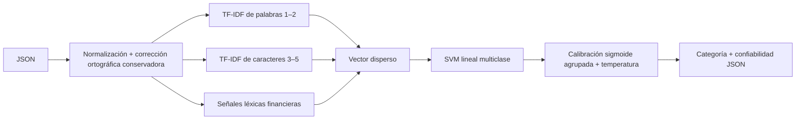

# Clasificador ML de transacciones financieras

Entregable de Data Science para **Financiera Saludable**. El proyecto recibe
transacciones en JSON y devuelve una categoría y una confiabilidad entre 0 y 1.
El modelo entrenado está en `modelos/clasificador_gastos.pkl`; no se usa Joblib.

## Los dos archivos que debes abrir

- `probar_modelo_json.py`: prueba el PKL con un JSON sin escribir comandos.
- `entrenar.py`: contiene y ejecuta todo el entrenamiento real, la comparación
  de algoritmos, la calibración y la evaluación.

Para probarlo en Visual Studio Code:

1. Edita `ejemplos/entrada_transacciones.json`.
2. Abre `probar_modelo_json.py`.
3. Pulsa **Run Python File**.
4. Revisa `ejemplos/salida_transacciones.json`.

El script se relanza automáticamente con `.venv_hackathon`, evitando el error
`No module named sklearn` aunque VS Code haya seleccionado el Python global.

## Contrato JSON

Entrada individual:

```json
{
  "descripcion": "Netflix",
  "valor": 15.0,
  "fecha": "2026-08-07"
}
```

Salida individual, con exactamente los dos campos acordados:

```json
{
  "categoria": "SUSCRIPCIONES",
  "confiabilidad": 0.999
}
```

También se aceptan lotes y se preserva el orden:

```json
{
  "transacciones": [
    {"descripcion": "Netflix", "valor": 15, "fecha": "2026-08-07"},
    {"descripcion": "aporte a fondo mutuo", "valor": 200, "fecha": "2026-08-07"}
  ]
}
```

```json
{
  "transacciones": [
    {"categoria": "SUSCRIPCIONES", "confiabilidad": 0.999},
    {"categoria": "APORTE_INVERSIONES", "confiabilidad": 0.9674}
  ]
}
```

`descripcion`, `valor` y `fecha` son obligatorios. El modelo NLP aprende solo de
`descripcion`; `valor` y `fecha` se validan para cumplir el contrato, pero no
cambian la predicción. Los esquemas formales están en `contratos/`.

## Qué Machine Learning utiliza

Es un clasificador supervisado multiclase, no un conjunto de reglas. El flujo es:


```mermaid
flowchart LR
    A["JSON"] --> B["Normalización + corrección ortográfica conservadora"]
    B --> C["TF-IDF de palabras 1–2"]
    B --> D["TF-IDF de caracteres 3–5"]
    B --> E["Señales léxicas financieras"]
    C --> F["Vector disperso"]
    D --> F
    E --> F
    F --> G["SVM lineal multiclase"]
    G --> H["Calibración sigmoide agrupada + temperatura"]
    H --> I["Categoría + confiabilidad JSON"]
```

Antes de elegir el modelo se compararon cinco familias con
`StratifiedGroupKFold` de cinco folds. Las variaciones de un mismo concepto nunca
aparecen simultáneamente en entrenamiento y prueba.

| Modelo | F1 macro agrupado | Exactitud agrupada |
|---|---:|---:|
| SVM lineal | **73.33%** | **73.50%** |
| Regresión logística | 73.22% | 72.55% |
| SGD logístico | 72.53% | 72.34% |
| Naive Bayes complementario | 72.35% | 73.58% |
| Bosque aleatorio | 68.23% | 68.67% |

La regla reproducible elige la mayor F1 macro agrupada entre las familias con
flujo probabilístico aprobado. Por ello la versión 3.3 usa `LinearSVC` (`C=2`) y
convierte sus márgenes en probabilidades mediante calibración sigmoide con folds
agrupados; una calibración de temperatura independiente ajusta finalmente la
`confiabilidad`. El PKL mide aproximadamente 15 MB. El resultado completo está en
`resultados/comparacion_modelos.json`.

## Datos y resultados actuales

El entrenamiento final usa exactamente **100,000 descripciones únicas**, casi
perfectamente balanceadas entre las 12 categorías:

- 118 textos manuales curados;
- 4,820 variantes ortográficas sistemáticas de señales del dominio;
- 95,062 variaciones sintéticas reproducibles de redacción y formato bancario;
- 94 casos separados para calibración y umbral;
- 72 casos de holdout final, nunca usados para decidir el modelo.

Los 100,000 textos no se guardan como un CSV gigante: `clasificador/datos.py`
los genera de forma determinista y el PKL incluye su hash SHA-256, conteos y
distribución. Esto mantiene Git liviano y permite reconstruir la misma base.
Una variación sintética mejora tolerancia de redacción, pero no equivale a una
transacción real independiente; para producción se necesitan datos reales
anonimizados.

| Métrica en holdout final (72 casos) | Resultado |
|---|---:|
| Exactitud | **97.22%** |
| F1 macro | **97.20%** |
| Log-loss | **0.0886** |
| Brier multiclase | **0.0360** |
| Error de calibración ECE | **4.29%** |
| Cobertura automática | **98.61%** |
| Precisión entre decisiones aceptadas | **98.59%** |

Además, `almuerzo` se clasifica como `ALIMENTACION` con 98.81% de confianza. La
batería de regresión alcanza 120/120 casos semánticos, 600/600 variantes con
mayúsculas, puntuación y ruido bancario, 960/960 deformaciones ortográficas
sistemáticas y 29/29 faltas dirigidas. El entrenamiento no publica un PKL nuevo
si incumple uno de esos controles.

Estas regresiones son controles conocidos, no sustituyen un holdout real. No se
puede garantizar que toda palabra inventada o muy deformada sea correcta: una
descripción ambigua o fuera del vocabulario puede fallar, y el backend debe usar
`confiabilidad` para decidir cuándo solicitar revisión humana.

Todos los resultados del modelo se escriben como **JSON** en `resultados/`.
Los tres CSV de `datos/` son únicamente particiones etiquetadas de entrada.

## Categorías

`ALIMENTACION`, `APORTE_INVERSIONES`, `EDUCACION`, `GASTOS_HORMIGA`, `INGRESOS`,
`OCIO`, `OTROS`, `SALUD`, `SERVICIOS`, `SUSCRIPCIONES`, `TRANSPORTE` y `VIVIENDA`.

Un aporte hacia una inversión es `APORTE_INVERSIONES`; un dividendo recibido es
`INGRESOS`. Un cargo recurrente de Netflix es `SUSCRIPCIONES`; una entrada
puntual al cine es `OCIO`.

## Estructura mínima

```text
entrenar.py                  entrenamiento, comparación y evaluación completa
probar_modelo_json.py        prueba de entrada JSON -> salida JSON
clasificador/datos.py        categorías y generación reproducible de datos
clasificador/modelo.py       TF-IDF, SVM lineal calibrada, confianza y PKL
clasificador/contrato_json.py validación del contrato del backend
datos/                       train, validación y holdout etiquetados
modelos/                     PKL final y checksum SHA-256
resultados/                  reportes y predicciones, todos en JSON
tests/                       pruebas automáticas
```

## Instalación y reproducción

La primera vez en una máquina nueva sí es necesario preparar el entorno:

```powershell
py -3.13 -m venv .venv_hackathon
.\.venv_hackathon\Scripts\python.exe -m pip install -r requirements.txt
```

Después se pueden ejecutar `probar_modelo_json.py` o `entrenar.py` con el botón
Run de VS Code. El entrenamiento completo tarda aproximadamente de cinco a ocho
minutos en la máquina de desarrollo y vuelve a generar el PKL y los reportes JSON.

Pruebas automáticas:

La versión entregada supera **43/43 pruebas**.

```powershell
.\.venv_hackathon\Scripts\python.exe -m pytest -q
```

Antes de integrar una copia nueva del modelo, el backend debe comprobar versión y
SHA-256 contra `modelos/manifiesto_modelo.json`. Esto evita desplegar por error un
PKL anterior que tenga el mismo nombre. El cargador exige exactamente la versión
3.3.0 y rechaza cualquier artefacto de otra versión.

La explicación técnica completa, límites y lectura guiada del código están en
[README_DATA.md](README_DATA.md).

> Seguridad: Pickle puede ejecutar código al cargarse. Usa solo el PKL del
> repositorio o de otra fuente confiable. `cargar_modelo` verifica el checksum
> SHA-256 antes de deserializar.
