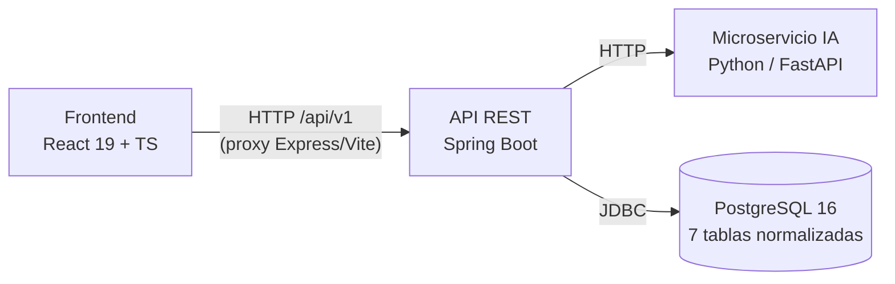

# 💜 Mi Salud Financiera


> **Aplicación web de gestión financiera gamificada.** Analiza tus ingresos, gastos y hábitos de ahorro, clasifica tus transacciones con un motor de IA y te devuelve un perfil financiero con recomendaciones accionables — todo acompañado de una mascota que celebra tus logros. 🎉

Proyecto nacido para la **HackathonG9 x Alura LATAM**: esta sección contiene el **frontend en React**, que consume una **API REST propia desarrollada en Spring Boot** con persistencia en **PostgreSQL normalizada**.

---

## 📸 Capturas de pantalla

> 📌 *Inserta aquí las capturas/GIFs del producto (sugerencia: guárdalas en `assets/screenshots/`):*

| Pantalla | Imagen |
|---|---|
| **Login** | `<!-- assets/screenshots/login.png -->` |
| **Dashboard** (perfil financiero + registro rápido) | `<!-- assets/screenshots/dashboard.png -->` |
| **Nuevo Análisis** (formulario multi-paso) | `<!-- assets/screenshots/nuevo-analisis.png -->` |
| **Historial de Análisis** (timeline + métricas) | `<!-- assets/screenshots/historial.png -->` |
| **Perfil de Usuario** | `<!-- assets/screenshots/perfil.png -->` |
| **GIF demo** (flujo completo: login → análisis → resultado) | `<!-- assets/screenshots/demo.gif -->` |


## ✨ Características principales

- 🎮 **Gamificación financiera**: mascota animada que reacciona a tu salud financiera, confetti al completar análisis (`canvas-confetti`) y perfiles con niveles (*Excelente → Crítico*) que motivan la mejora progresiva.
- 🧠 **Análisis financiero inteligente**: el backend orquesta un motor de clasificación (microservicio Python/NLP) que categoriza transacciones y calcula tu **perfil financiero** con probabilidades y recomendaciones personalizadas.
- ⚡ **Registro rápido de gastos** desde el Dashboard, con clasificación automática de la transacción en tiempo real.
- 📊 **Informes y distribución de gastos** por categoría con colores dinámicos y estados vacíos cuidados.
- 🕓 **Historial de análisis paginado**, con vista de línea de tiempo y detalle de cada análisis.
- 👤 **Gestión de perfil**: edición protegida de datos personales contra la API (actualización parcial de nombre/email).
- 🛡️ **Manejo de errores de extremo a extremo**: el frontend propaga y traduce los errores tipados del backend (400/401/404/409/502/503) a mensajes amigables ([src/utils/apiErrors.ts](src/utils/apiErrors.ts)).

## 🧰 Stack tecnológico

| Capa | Tecnología | Detalle |
|---|---|---|
| **Frontend** | React 19 + TypeScript + Vite 6 | TailwindCSS v4, React Router 7, Motion (animaciones), Lucide (iconos) |
| **Servidor web** | Express (`server.ts`) | Sirve el build y hace proxy de `/api` hacia el backend |
| **Backend** | Java 21 + Spring Boot 3.4 | API REST propia (repositorio aparte), validación con Bean Validation, manejo global de excepciones |
| **IA / NLP** | Microservicio Python (FastAPI) | Clasificación de transacciones y perfil financiero (modelos `.pkl`) |
| **Base de datos** | PostgreSQL 16 | Esquema normalizado de 7 tablas principales (`users`, `transactions`, `analyses`, `recommendations`, entre otras) |

## 🏗️ Arquitectura



- El frontend nunca habla directo con la base de datos: toda la lógica de negocio y persistencia vive en la API Spring Boot.
- En desarrollo, Vite hace proxy de `/api/v1` hacia `http://localhost:8080` (ver [vite.config.ts](vite.config.ts)); en producción, el servidor Express reenvía `/api` a la URL definida en `BACKEND_URL`.

### 🎯 Decisión técnica destacada: camelCase ↔ snake_case

El contrato JSON de la API usa **snake_case** (`ingreso_mensual`, `fecha_transaccion`…), mientras que el frontend trabaja en **camelCase** idiomático de TypeScript. La transformación se resuelve en la **capa de API**:

- En el frontend, [src/utils/mapeadores.ts](src/utils/mapeadores.ts) actúa como *Anti-Corruption Layer*: mapea y normaliza cada respuesta del backend (nombres de campos, denominaciones de perfil, estados de recomendación) antes de que toque los componentes.
- En el backend, Jackson serializa automáticamente los Java Records en camelCase hacia el formato snake_case del contrato.

Esto mantiene ambos mundos idiomáticos y desacopla el frontend de cambios en el contrato del backend.

### 📐 Metodología: Spec-Driven Development (SDD) con OpenSpec

El desarrollo del frontend siguió **Spec-Driven Development** usando [OpenSpec](https://github.com/Fission-AI/OpenSpec): cada funcionalidad se planificó primero como un *change* con especificación, diseño y tareas antes de escribir código, y al completarse se archivó y sincronizó con las specs principales. El resultado es un historial vivo y auditable del producto:

- [openspec/specs/](openspec/specs/) — más de 40 especificaciones de capacidades vigentes (autenticación, análisis, historial, informes, manejo de errores, etc.).
- [openspec/changes/archive/](openspec/changes/archive/) — registro cronológico de cada cambio implementado.

Esta disciplina garantizó trazabilidad requisito → código y facilitó iterar rápido sin perder coherencia entre pantallas.

## 🚀 Instalación y ejecución local

### Prerrequisitos

- **Node.js** 20+ y npm
- **Java 21 + Maven** (para el backend) o **Docker Desktop** (para levantar todo el ecosistema)
- Backend Spring Boot corriendo en `http://localhost:8080` — sin él, login, análisis e historial no funcionan

### Frontend (este repositorio)

```bash
# 1. Clonar e instalar dependencias
git clone https://github.com/<tu-usuario>/HackatonG9-Frontend-Finance.git
cd financeai
npm install

# 2. (Opcional) configurar variables de entorno
#    Copiar .env.example a .env.local si necesitas sobreescribir algo
cp .env.example .env.local

# 3. Levantar la app en http://localhost:3000
npm run dev
```

### Backend (repositorio aparte)

```bash
# Opción A — Maven local
cd backend
./mvnw spring-boot:run     # levanta la API en http://localhost:8080

# Opción B — Docker Compose (levanta API + PostgreSQL + microservicio Python)
docker compose up --build -d
```

### Variables de entorno

| Variable | Requerida | Descripción |
|---|---|---|
| `BACKEND_URL` | Solo en producción | URL del backend Spring Boot. Default local: `http://localhost:8080` |
| `PORT` | No | Puerto del servidor Express. Default: `3000` (los hostings suelen inyectarlo) |

### Scripts disponibles

| Script | Descripción |
|---|---|
| `npm run dev` | Servidor de desarrollo (Express + Vite middleware) en `http://localhost:3000` |
| `npm run build` | Compila el frontend con Vite y empaqueta `server.ts` para producción |
| `npm run start` | Corre el build de producción (`dist/server.cjs`) |
| `npm run preview` | Sirve el build de producción de Vite localmente |
| `npm run lint` | Chequeo de tipos con `tsc --noEmit` |
| `npm run clean` | Elimina `dist/` y el bundle del servidor |

## 📂 Estructura del proyecto (frontend)

```text
financeai/
├── server.ts                     # Servidor Express: sirve el build y hace proxy /api → backend
├── vite.config.ts                # Config de Vite (proxy /api/v1 en desarrollo)
├── docs/
│   └── READMEback.md             # Documentación de la API backend (endpoints, errores, Docker)
├── openspec/                     # Specs SDD: capacidades vigentes + changes archivados (OpenSpec)
│   ├── specs/                    # Especificaciones de cada capacidad del producto
│   └── changes/archive/          # Historial de cambios implementados
└── src/
    ├── App.tsx                   # Enrutamiento y layout principal
    ├── types.ts                  # Tipos compartidos del dominio (PerfilFinanciero, etc.)
    ├── assets/
    │   └── mascots.ts            # Mascota financiera: variantes según estado/perfil
    ├── components/
    │   ├── LoginModal.tsx        # Autenticación (login/registro contra /api/v1/auth)
    │   ├── DashboardView.tsx     # Dashboard: perfil actual + registro rápido de gastos
    │   ├── NewAnalysisView.tsx   # Formulario de nuevo análisis financiero
    │   ├── HistoryView.tsx       # Historial paginado de análisis
    │   ├── ReportsView.tsx       # Informes: distribución de gastos por categoría
    │   ├── SettingsProfileView.tsx  # Edición protegida del perfil de usuario
    │   ├── AnalysisDetailModal.tsx  # Detalle de un análisis individual
    │   ├── AnalysisTimelineModal.tsx # Línea de tiempo de análisis
    │   ├── OnboardingModal.tsx   # Flujo de onboarding inicial
    │   ├── Sidebar.tsx / TopNavbar.tsx / Footer.tsx  # Navegación y layout
    └── utils/
        ├── mapeadores.ts         # Anti-Corruption Layer: snake_case → camelCase + normalización
        ├── apiErrors.ts          # Traducción de errores HTTP del backend a mensajes de UI
        ├── categorizer.ts        # Categorización local de transacciones
        ├── colorManager.ts       # Colores dinámicos por categoría de gasto
        └── numberUtils.ts        # Formateo de montos y números
```

## 🎨 Decisiones de diseño UI/UX

- **Paleta de colores**: púrpura/índigo como color primario (confianza, tecnología) con acentos naranja/coral (energía, celebración) para CTAs y estados positivos.
- **Tipografía**: **Poppins** para titulares e interfaz, **DM Mono** para cifras y montos — la fuente monoespaciada facilita la lectura y comparación de valores financieros.
- **Layout desktop-first basado en tarjetas**: cada bloque de información (perfil, métricas, recomendaciones) vive en una tarjeta independiente, lo que hace el dashboard escaneable en segundos.
- **Mascota financiera**: elemento central de la gamificación; cambia de expresión según el perfil financiero del usuario y humaniza un dominio tradicionalmente árido.
- **Estados vacíos y de error diseñados**: cada vista tiene un estado vacío con ilustración y CTA, evitando pantallas en blanco para usuarios nuevos.

## 🗺️ Roadmap / mejoras futuras

- [ ] **Autenticación real con JWT**: el token de sesión actual es simulado; falta validación, expiración y protección de endpoints en el backend.
- [ ] **Asociar análisis al usuario autenticado**: hoy `POST /analizar` persiste contra el primer usuario de la BD — bloqueante para multi-usuario real.
- [ ] Borrado en cascada de cuentas con historial asociado.
- [ ] Modo responsive/mobile completo (actualmente desktop-first).
- [ ] Tests unitarios y E2E (Vitest + Playwright).
- [ ] Internacionalización (i18n) y modo oscuro.

## 👩‍💻 Autoría y contacto

Proyecto desarrollado como parte del **Hackathon G9 – LATAM (Team 17)**. Frontend a cargo de:

> 
>📌 **[Alina Karie Arango Silva]** — [LinkedIn](https://www.linkedin.com/in/alina-karie-arango-silva/) · [GitHub](https://github.com/dear-alina)


